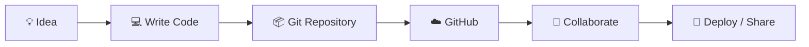
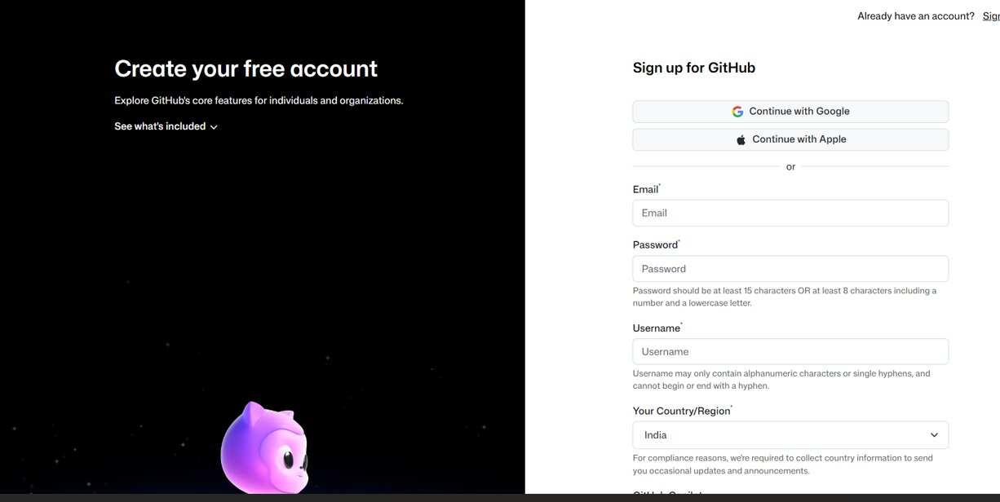
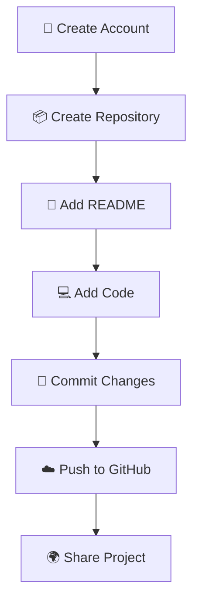
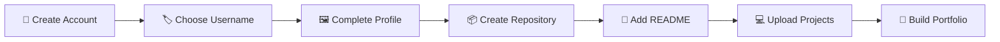
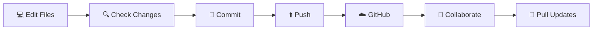

# 🚀 GitHub Documentation for New Users

> 🌟 **Welcome to GitHub!**  
> This guide will help you create your GitHub account, choose a professional username, and create your first repository.

---

## 🧭 Introduction

**GitHub** is a platform that supports the entire software development process, from planning and writing code to collaboration, deployment, and project management.

Whether you are starting a new project or contributing to an existing one, GitHub provides the tools and workflows needed throughout the **Software Development Life Cycle (SDLC)**.

### ✨ Why should you use GitHub?

GitHub is especially useful for students and developers because it allows you to:

- 📁 Store your projects online.
- 🕒 Track changes in your code.
- 🤝 Collaborate with other developers.
- 🌍 Share your work publicly.
- 💼 Build a professional developer portfolio.
- 🔄 Manage different versions of your projects.
- 🚀 Showcase your projects to recruiters and companies.

### 🗺️ GitHub at a Glance



---

<p align="center">
  
</p>

<p align="center">
  <strong>🌐 GitHub Homepage</strong>
</p>

---

# 🔀 GitHub and Git

GitHub is built around **Git**, an open-source version control system.

### 🧩 What is Git?

**Git** is a version control system that tracks changes made to files.

It allows you to:

- 📝 Keep a history of your changes.
- 💻 Work on your own copy of a project.
- 🗂️ Create different versions of your project.
- ↩️ Recover previous versions when necessary.
- 🔀 Merge your changes with other people's work.
- 🛡️ Reduce the risk of losing your work.

### ☁️ What is GitHub?

**GitHub** is a cloud-based platform that hosts Git repositories and adds collaboration and project-management features.

### ⚡ Git vs GitHub

| 🛠️ Git | ☁️ GitHub |
|---|---|
| Version control system | Online development platform |
| Works locally on your computer | Hosts repositories online |
| Tracks file changes | Adds collaboration features |
| Open-source software | Cloud-based service |

> 💡 **Remember:**  
> **Git = Version Control** 🔄  
> **GitHub = Git + Collaboration + Cloud** ☁️🤝

---

# 🛠️ Setting Up Your GitHub Account

To start using GitHub, first create a GitHub account.

## 📝 Step 1: Sign Up

Go to GitHub and select **Sign up**.

You can create your account using an email address or continue with an available sign-in option such as Google or Apple.

<p align="center">
  
</p>

<p align="center">
  <strong>🔐 GitHub Sign Up Page</strong>
</p>

---

## 👤 Step 2: Choose a Professional Username

Your GitHub username is important because it becomes part of your GitHub profile URL.

For example:

```text
github.com/yourusername
```

### ✅ A good username should be:

- 👔 Professional
- 🧠 Easy to remember
- ✨ Simple and clean
- 💻 Related to your name or technical field

### 💡 Username Recommendations

If possible, use your name or a clean variation of it.

```text
manavchaudhary
manav-chaudhary
manavcodes
manavdev
manavtech
```

If your preferred username is already taken, you can add something related to your technical domain:

```text
tech
dev
code
coding
```

> ⚠️ **Tip:** Avoid unnecessary numbers, random characters, or usernames that look unprofessional.

---

# 📦 Creating Your First Repository

A **repository (repo)** is a place on GitHub where you can store your project files, source code, documentation, and other resources.

### 🎯 Why create a repository?

- 📁 Store your code.
- 🕒 Track project history.
- 📚 Maintain project documentation.
- 🌐 Share your project with others.
- 🤝 Collaborate with developers.
- 💼 Build your portfolio.

### 🔄 Repository Workflow



---

# 🪜 Step-by-Step: Create a Repository

## 1️⃣ Open GitHub

Log in to your GitHub account.

---

## 2️⃣ Select the `+` Button ➕

In the **top-right corner** of GitHub, select the **+** button.

Then choose:

> **📦 New repository**

---

## 3️⃣ Choose the Repository Name 🏷️

For your first repository, it is recommended to create a repository using your **GitHub username**.

For example, if your username is:

```text
manavchaudhary
```

your repository can be:

```text
manavchaudhary
```

This type of repository can be used as your **GitHub profile README**, allowing you to:

- 👋 Introduce yourself.
- 🛠️ Display your skills.
- 🚀 Highlight your projects.
- 📊 Show your GitHub activity.

---

## 4️⃣ Add a Description 📝

Enter a short description explaining what the repository is for.

Example:

```text
My GitHub profile and developer portfolio.
```

> 💡 **Keep the description short and meaningful.**

---

## 5️⃣ Select Repository Visibility 🌍

Use the **Choose visibility** option.

For a portfolio or public project, select:

### 🌐 Public

A public repository can be viewed by other people and can help showcase your work to:

- 👨‍🏫 Teachers
- 👨‍💻 Developers
- 💼 Recruiters
- 🏢 Companies

> 🔐 **Security Tip:** Never upload passwords, API keys, private credentials, or other sensitive information to a public repository.

---

## 6️⃣ Add a README 📖

Select:

> **☑️ Add a README file**

The README provides a place to describe your repository and is usually the first document visitors see when they open your project.

A good README can include:

```text
👋 About Me
🛠️ Skills
📚 Technologies
🚀 Projects
📫 Contact
```

---

## 7️⃣ Create the Repository 🎉

Finally, select:

> **🚀 Create repository**

🎊 **Congratulations! Your GitHub repository is now ready.**

---

# 🌟 Recommended First GitHub Setup

Follow this simple roadmap:



### ✅ Your first GitHub checklist

- [ ] 👤 Create a GitHub account.
- [ ] 🏷️ Choose a professional username.
- [ ] 🖼️ Complete your GitHub profile.
- [ ] 📦 Create your username repository.
- [ ] 📖 Add a professional README.
- [ ] 🛠️ Add your skills and technologies.
- [ ] 🚀 Add your best projects.
- [ ] 📁 Keep your repositories organized.
- [ ] 💾 Commit your work regularly.

---

# 🧠 Important GitHub Terms

| 🔑 Term | 📖 Meaning |
|---|---|
| **Git** | 🔄 Version control system used to track changes |
| **GitHub** | ☁️ Platform for hosting and collaborating on Git projects |
| **Repository** | 📦 Storage location for a project and its files |
| **README** | 📖 Documentation file that explains a project |
| **Commit** | 💾 A saved record of changes |
| **Branch** | 🌿 Separate line of development |
| **Clone** | 📥 Download a repository to your computer |
| **Push** | ⬆️ Upload local changes to GitHub |
| **Pull** | ⬇️ Retrieve changes from a remote repository |
| **Fork** | 🍴 Create your own copy of another user's repository |

---

# 🔄 Basic GitHub Workflow

Once you start developing, a common workflow looks like this:



### 💻 Example workflow

```bash
git add .
git commit -m "Add new project"
git push
```

> 🚀 **Tip:** Make small, meaningful commits instead of putting every change into one huge commit.

---

# 🏆 Tips for a Professional GitHub Profile

### ⭐ Do

- ✅ Use a professional username.
- ✅ Add a profile picture.
- ✅ Write a short bio.
- ✅ Add your skills.
- ✅ Pin your best projects.
- ✅ Write good README files.
- ✅ Commit regularly.
- ✅ Keep your repositories organized.

### ❌ Don't

- ❌ Upload passwords.
- ❌ Upload API keys.
- ❌ Upload private credentials.
- ❌ Use confusing repository names.
- ❌ Copy projects without understanding them.
- ❌ Leave repositories completely undocumented.

---

# 🎯 Your GitHub Journey

```text
👤 Create Account
       ↓
🏷️ Choose Username
       ↓
🖼️ Complete Profile
       ↓
📦 Create Repository
       ↓
📖 Add README
       ↓
💻 Build Projects
       ↓
💾 Commit Changes
       ↓
☁️ Push to GitHub
       ↓
🌍 Share Your Work
       ↓
💼 Build Your Portfolio
```

---

# 🎉 Conclusion

GitHub is an essential platform for modern software development.

For a new developer or student, creating a professional GitHub account is a great first step toward building an online portfolio.

Start with a clean username, create your first repository, add a README, and gradually upload your projects as you learn.

> 🚀 **Build projects.**
>
> 💾 **Commit your work.**
>
> 🌍 **Share your progress.**
>
> 🤝 **Collaborate with others.**
>
> 📚 **Keep learning.**

---

## ⭐ Final Reminder

> 💡 **Your GitHub profile is more than just a place to store code — it is your developer portfolio.**
>
> 🌟 Keep building → Keep learning → Keep committing → Keep growing 🚀

<p align="center">
  <strong>💻 Happy Coding! 🚀</strong>
</p>
